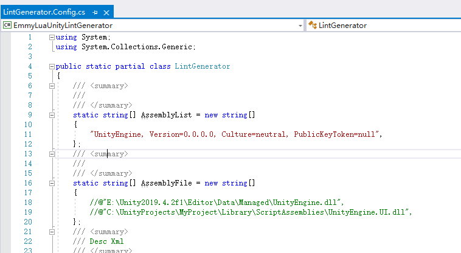
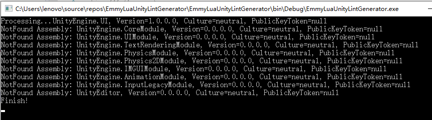
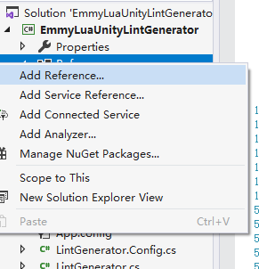
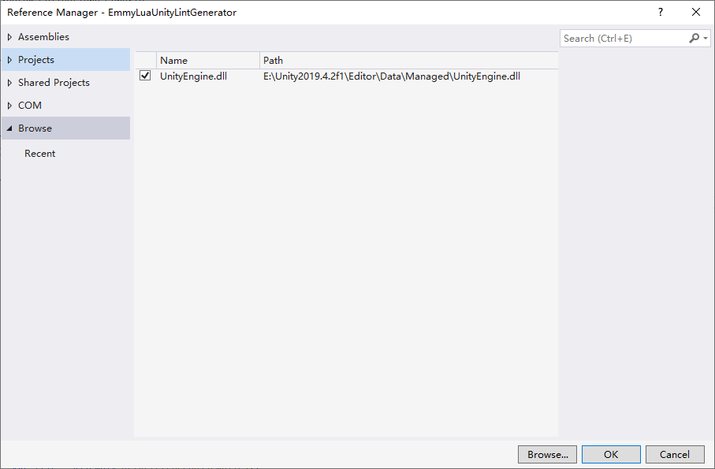

# EmmyLuaUnityLintGenerator
Unity Lint For EmmyLua Generator

## 1. Open Project
Open Project In VisualStudio. 

## 2. Edit Config
Open [LintGenerator.Config.cs](./EmmyLuaUnityLintGenerator/LintGenerator.Config.cs). Add Assembly name or path.

## 3. Add Reference
Some Assembly need other assembly be loaded. Tool will print missing Assembly.

We need add these assembly. We should open Reference Manager.

## 4. Run

Run It！

## 5. How to run in Unity

We should copy these files "LintGenerator.Config.cs", "LintGenerator.cs", "LintGenerator.Xml.cs" to our unity asset directory.

Run Menu "Tools" -> "GenerateUnityLint".

-------------------------------------------------------------------------------

## 1. 打开工程
在VisualStudio中，打开工程

## 2. 编辑配置
打开[LintGenerator.Config.cs](./EmmyLuaUnityLintGenerator/LintGenerator.Config.cs). 在文件中添加需要导出Api提示的Assembly名字或者路径。

## 3. 添加引用
一些Assembly需要引用其他的Assebmy。如果缺少，工具会提示缺少哪些Assembly。

我们可以在Reference Window中添加需要的Assembly。

## 4. 运行

运行！

## 5. 如何在Unity中使用

我们需要拷贝LintGenerator.Config.cs，LintGenerator.cs，LintGenerator.Xml.cs这三个文件到我们的unity asset路径下。

选择菜单"Tools" -> "GenerateUnityLint"。
